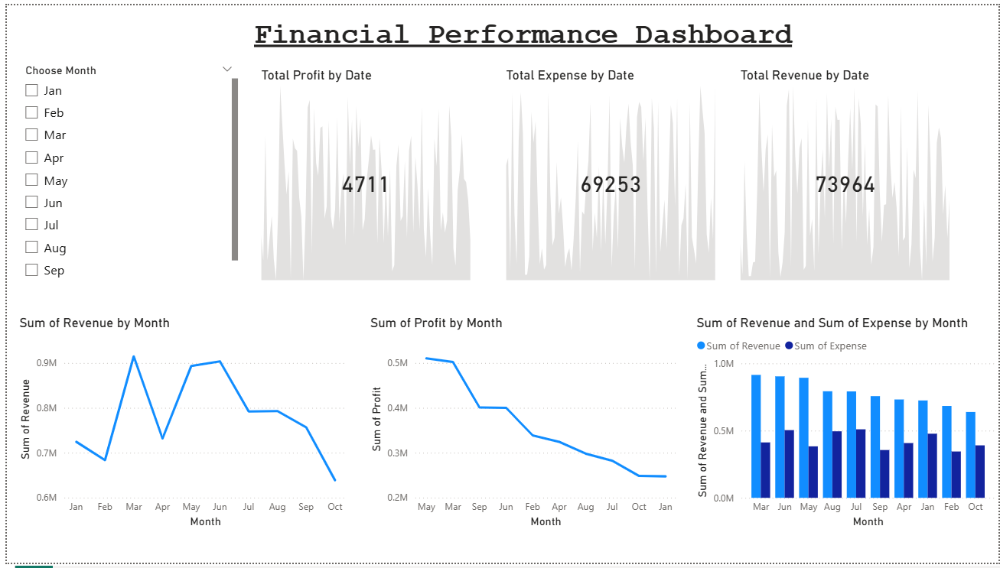

# PowerBI-Financial-Performance-Dashboard

# Financial Performance Dashboard (Power BI)

This project presents an interactive Power BI dashboard designed to analyze financial performance metrics such as revenue, expenses, and profit.

## Features

* KPI metrics for Revenue, Profit, and Expenses
* Monthly trend analysis
* Revenue vs Expense comparison
* Interactive month filter using slicers

## Tools Used

* Power BI
* Excel
* Power Query

## Insights

The dashboard helps identify revenue trends, monitor expense patterns, and evaluate overall business profitability.

